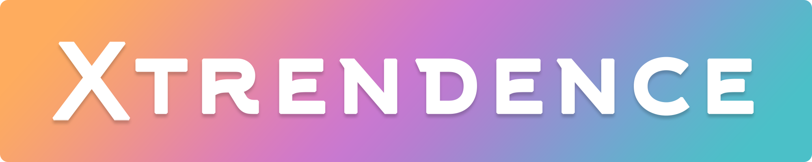
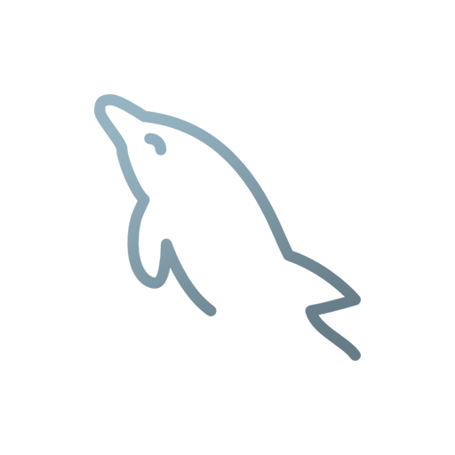

### Xtrendence - Khodadad (Adrian) Nouchin
---

	

---
#### About Me
---

Degree: BSc (Hons) Computing - 1:1 (First) w/ 80% Average

App, web, and software developer proficient at HTML and CSS, as well as programming languages such as JavaScript/TypeScript (and jQuery), PHP, Java, Dart, and C#. Familiar with relational and graph databases (MySQL/MS SQL and Neo4j respectively), in addition to being able to leverage stored procedures. Experienced with cross-platform app development with frameworks such as React Native and Flutter.

Highly focused on writing clean, readable code, while following best OOP practices and the software development life cycle in order to provide clients with a product that fits the user requirements.

---

#### I can code in...

	
	
	
	
	
	
	
	
	

---
#### I can speak...

	
	
	
	

---
#### I can use...

	
	
	
	
	
	
	
	
	

 

Click for More Information...

---
#### Skills
---

► Develop and maintain responsive and SEO-focused websites using HTML, CSS, and JavaScript (including React, TypeScript, and jQuery).

► Develop websites' and web apps' backends using Node.js and PHP.

► Set up, modify and maintain SQL databases, and write stored procedures, create views, and set up triggers.

► Use version control systems like Git to work on and manage small to larger scale projects.

► Set up a network and web server while ensuring that it is secure using Apache or Node.js (this includes any necessary port forwarding and creation of any DDNS records in order to make the server externally accessible, and public facing).

► Develop complex mobile applications for the Android operating system using React Native, Flutter, or Java.

► Develop simple desktop applications using Java or C# (with WinForms or UWP).

► Develop complex desktop applications using Node.js and Electron.

► Utilize and develop RESTful APIs.

► Develop APIs using GraphQL.

► Use Agile methodology when working on projects.

► Work in multicultural teams by knowing four languages including English, Italian, Farsi and Spanish.

► Adapt to new environments and working conditions as required.

► Learn new topics quickly and effectively.

► Develop a system following the software development life cycle.

---
#### Experience
----

► Developed a website in a two-man team as part of our work experience that offered revision material for math students.

► Participated and almost got into the finals of the 2018 UK Cybercenturion competition, where we were tasked with identifying, and eliminating any security risks or possible exploits on several machines running both Windows and Linux.

► Worked on a year long university project with five other students on developing a website and mobile app with a MySQL database to store the application's data. The development of the software required utilizing the Scrum framework as part of an Agile methodology. Requirements were gathered from the client, UML diagrams and user stories were written, tasks were assigned as part of sprints, and the final product was presented to the client.

► Worked on and published numerous personal projects that involved the usage of the skills listed above, these projects are viewable on my GitHub page as well as my [portfolio](https://www.xtrendence.dev).
	

